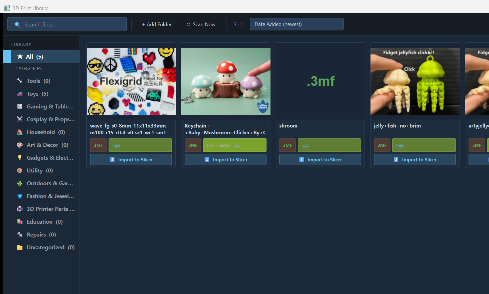

# 3D Print Library

A Steam-style desktop library for managing your local 3D print files — `.3mf`, `.stl`, `.obj`, `.step`, `.gcode` and more. Browse your collection with thumbnail previews, filter by category and sub-category, and send files directly to your slicer.



---

## Features

- **Auto-scan folders** — point the app at any folder (or multiple folders) and it finds all your 3D print files recursively
- **Smart auto-categorization** — files are categorized automatically from filename keywords into 14 parent categories with 34 built-in sub-categories
- **Hierarchical sidebar** — collapsible tree with parent → sub-category drill-down and live file counts
- **Thumbnail previews** — extracts built-in thumbnails from `.3mf` files; searches online (DuckDuckGo) for STL previews; falls back to a live 3D matplotlib render
- **Smart 3MF import** — sends `.3mf` files to your slicer with printer/filament settings stripped, so your slicer setup is never overridden — but all painted colors, multi-material assignments, and modifier meshes are fully preserved
- **Auto-detect slicers** — finds your installed slicers via Windows Registry, Program Files, AppData, and drive roots — no manual .exe hunting
- **13 slicers supported** — OrcaSlicer, Bambu Studio, PrusaSlicer, UltiMaker Cura, Snapmaker Luban, Creality Print, Chitubox, Lychee Slicer, FlashPrint, Anycubic Photon Workshop, ideaMaker, Simplify3D, SuperSlicer
- **Customizable categories** — add, rename, delete, and style (icon + color) any category or sub-category from Settings
- **Right-click context menu** — rename, change category, edit notes, refresh thumbnail, open file location, remove from library
- **Search & filter** — live search bar + category/sub-category sidebar filters
- **SQLite library database** — stored in `~/.3dprintlibrary/`, nothing is moved or modified on disk

---

## Requirements

- Windows 10 / 11
- Python 3.10 or newer ([python.org](https://python.org))

---

## Installation

### 1. Clone or download the repo

```bash
git clone https://github.com/drewbiehd/3DPrintLibrary.git
cd 3DPrintLibrary
```

Or download the ZIP from GitHub → **Code → Download ZIP**, then extract it.

### 2. Install dependencies

```bash
pip install -r requirements.txt
```

This installs: PySide6 (UI), Pillow (images), numpy-stl + matplotlib (3D render), duckduckgo-search (online thumbnails), and requests.

### 3. Run the app

```bash
python main.py
```

On first launch you will be prompted to add a folder. The app will also automatically detect any installed slicers.

---

## Quick Start

### Adding your files

1. Click **+ Add Folder** in the toolbar (or go to **⚙ Settings → Folders**)
2. Select the folder where your `.stl` / `.3mf` files live — subfolders are scanned automatically
3. Click **↻ Scan Now** — the library fills with cards

### Browsing

| Action | How |
|---|---|
| Filter by parent category | Click a category in the left sidebar |
| Filter by sub-category | Expand a parent and click a child row |
| Search | Type in the search bar — filters live as you type |
| Sort | Use the **Sort** dropdown in the toolbar |

### Opening files in your slicer

| File type | Button behaviour |
|---|---|
| **STL / OBJ** | **▶ Open in Slicer** — passes the file directly |
| **3MF** | **⬇ Import to Slicer** — strips printer/filament settings before sending, so your current slicer profile is untouched. Painted colors and multi-material structure are fully preserved. |

If you have multiple slicers configured, clicking the button shows a picker menu.

To load a `.3mf` as a full project (including its embedded settings), right-click the card → **📂 Open as Project**.

### Right-click menu (any card)

| Option | What it does |
|---|---|
| ⬇ Import to Slicer / ▶ Open in Slicer | Send to slicer (submenu if multiple slicers) |
| 📂 Open as Project | 3MF only — load with all embedded settings |
| 🏷 Change Category | Two-level picker — choose parent and optional sub-category |
| ✏ Rename | Set a display name (original filename unchanged) |
| 📝 Edit Notes | Add personal notes to this file |
| 🔄 Refresh Thumbnail | Delete cached thumbnail and regenerate |
| 📂 Open File Location | Open the containing folder in Explorer |
| 🗑 Remove from Library | Remove from the library DB (file stays on disk) |

---

## Categories & Sub-Categories

Files are auto-categorized on scan using keyword matching — parent category first, then sub-category within that parent. You can override any file's category via right-click → **Change Category**.

| Parent Category | Built-in Sub-Categories |
|---|---|
| 🔧 **Tools** | Hand Tools · Workshop & Jigs · Measuring |
| 🚗 **Toys** | Clicker Toys · Flexi & Articulated · Action Figures · Vehicles · Puzzles · Animals & Creatures |
| 🎲 **Gaming & Tabletop** | Miniatures · Terrain & Scenery · Dice & Accessories · Board Game Inserts |
| ⚔ **Cosplay & Props** | Weapons & Props · Armor & Wearables · Movie & TV |
| 🏠 **Household** | Kitchen · Bathroom · Storage & Org · Garage & Workshop |
| 🎨 **Art & Decor** | Sculptures & Busts · Wall Art · Vases & Planters |
| 💡 **Gadgets & Electronics** | Phone & Tablet · PC & Peripherals · Arduino & Pi · Audio |
| 🖨 **3D Printer Parts** | Bambu / Orca · Prusa · Creality / Ender · Voron · General Upgrades |
| 📦 **Utility** | *(no sub-categories — add your own!)* |
| 🌿 **Outdoors & Garden** | *(no sub-categories)* |
| 💎 **Fashion & Jewelry** | *(no sub-categories)* |
| 📚 **Education** | *(no sub-categories)* |
| 🔩 **Repairs** | *(no sub-categories)* |
| 📁 **Uncategorized** | *(catch-all)* |

---

## Customizing Categories

Open **⚙ Settings → 🏷 Categories** to manage the full hierarchy.

| Button | What it does |
|---|---|
| **+ Add Category** | Create a new top-level category |
| **+ Add Sub-Category** | Add a child under the currently selected parent |
| **✏ Rename** | Rename any category or sub-category — all files update automatically |
| **🎨 Style** | Change the emoji icon and pick a custom color |
| **🗑 Delete** | Delete custom categories (built-ins are protected). Files move up to the parent or Uncategorized. |

---

## Settings

Open **⚙ Settings** from the toolbar.

### Folders tab
Add or remove the watch folders that the library scans. Hit **↻ Scan Now** in the toolbar to re-scan after adding folders.

### Slicers tab
- **🔍 Auto-Detect Slicers** — searches the Windows Registry, Program Files, AppData, and drive roots for any of the 13 supported slicers. Runs automatically on first launch.
- **+ Add Manually** — browse to any `.exe` if your slicer wasn't auto-detected
- **✕ Remove Selected** — remove a slicer from the list

### Categories tab
Full hierarchy editor — see [Customizing Categories](#customizing-categories) above.

### Thumbnails tab
| Option | Default | Notes |
|---|---|---|
| Internet image search | ✅ On | DuckDuckGo — no API key needed |
| 3D render fallback | ✅ On | Uses matplotlib; disable if your PC is slow |
| Clear thumbnail cache | — | Deletes all cached PNGs; regenerated on next scan |

---

## How 3MF Import Works

Standard behavior when you pass a `.3mf` to a slicer on the command line is to open it as a full project — this overrides your printer profile, filament settings, and process settings with whatever was saved in the file.

3D Print Library solves this by creating a temporary stripped copy of the `.3mf` before sending it to your slicer:

**Stripped** (printer/filament/process profiles):
- `Metadata/project_settings.config`
- `Metadata/filament_settings_*.config`
- `Metadata/machine_settings_*.config`
- `Metadata/process_settings_*.config`
- Compiled G-code

**Kept** (all model data):
- `3D/3dmodel.model` — geometry **and** all `paint_color` triangle attributes (brush-painted color sections)
- `Metadata/model_settings.config` — per-object extruder slot assignments
- Plate layout and thumbnails

The result: your colors and multi-material structure import intact, your slicer settings are never touched.

---

## Supported File Formats

| Format | Thumbnails | Notes |
|---|---|---|
| `.3mf` | ✅ Extracted from file | Full color/multi-material import support |
| `.stl` | 🌐 Online search → 🎲 3D render | Most common format |
| `.obj` | 🌐 Online search | Wavefront OBJ |
| `.step` / `.stp` | 🌐 Online search | CAD format |
| `.gcode` | — | Sliced files, placeholder icon |

---

## Data & Privacy

- Your library database is stored at `~/.3dprintlibrary/library.db` (SQLite)
- Thumbnails are cached at `~/.3dprintlibrary/thumbnails/`
- No files are ever moved, renamed, or modified
- Internet image search uses DuckDuckGo — no account or API key required
- Nothing is sent anywhere except anonymous image searches when generating STL thumbnails (can be disabled in Settings → Thumbnails)

---

## License

MIT — do whatever you want with it.
